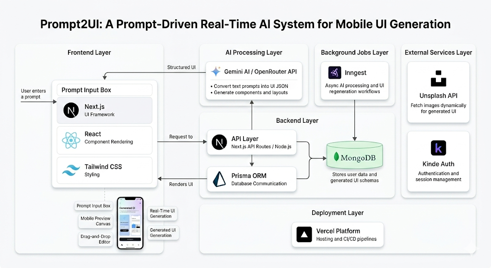

# Prompt2UI 🚀

### A Prompt-Driven Real-Time AI System for Mobile UI Generation

Prompt2UI is an **AI-powered mobile UI generation system** that converts natural-language prompts into structured and interactive mobile user interface designs. It enables users to quickly visualize application ideas, regenerate designs in real time, and customize generated layouts without requiring advanced UI/UX or coding skills.

By combining **Generative AI, interactive editing, image integration, authentication, and cloud services**, Prompt2UI provides a faster approach to mobile UI prototyping and design exploration.

---

## 📌 Overview

Designing mobile application interfaces traditionally requires design expertise, technical knowledge, and significant manual effort. Prompt2UI simplifies this process by allowing users to describe their desired interface using natural language.

For example:

> **"Create a food delivery app with a search bar, restaurant cards, category buttons, and a bottom navigation bar."**

The system processes the prompt using AI and generates a structured mobile UI layout that can be visualized and refined interactively.

Users can:

* Generate mobile UI designs from natural-language prompts
* Regenerate designs by modifying prompts
* Interact with generated layouts
* Drag and reposition mobile UI elements
* Customize themes and layouts
* Integrate real images into designs
* Save generated designs
* Export designs as PNG images

---

## ✨ Key Features

### 🤖 AI-Powered UI Generation

Generate structured mobile interfaces from simple natural-language descriptions using **Gemini AI**.

### 🔄 Real-Time Regeneration

Modify prompts and regenerate interfaces to quickly explore different design ideas.

### 🎨 Interactive Design Canvas

Visualize generated interfaces inside an interactive mobile device frame and refine layouts through drag-and-drop interaction.

### 🖼️ Image Integration

Integrates the **Unsplash API** to retrieve relevant images and enhance generated interface designs.

### 🔐 Secure Authentication

Uses **Kinde Auth** for user registration, authentication, and session management.

### 💾 Design & User Data Storage

Stores user information and generated UI structures using **MongoDB** with **Prisma ORM**.

### ⚡ Background Processing

Uses **Inngest** to handle asynchronous tasks such as AI processing and UI regeneration workflows.

### 📤 Design Export

Allows users to export generated mobile UI designs as **PNG images**.

### 📱 Responsive Interface

Built with modern web technologies to provide a clean and responsive user experience.

---

## 🏗️ System Architecture

Prompt2UI follows a modular architecture connecting the frontend, backend, AI services, database, authentication, image services, and background processing.



### Architecture Components

| Component             | Technology              | Purpose                                              |
| --------------------- | ----------------------- | ---------------------------------------------------- |
| Frontend              | Next.js, React          | User interface and UI rendering                      |
| Styling               | Tailwind CSS, Shadcn UI | Responsive and reusable UI components                |
| Backend               | Next.js API Routes      | Request handling and service integration             |
| AI                    | Gemini AI               | Natural-language prompt processing and UI generation |
| AI Gateway            | OpenRouter API          | AI model request routing                             |
| Database              | MongoDB                 | User and generated UI data storage                   |
| ORM                   | Prisma                  | Database schema and query management                 |
| Authentication        | Kinde Auth              | User authentication and session management           |
| Images                | Unsplash API            | Dynamic image integration                            |
| Background Processing | Inngest                 | Asynchronous AI and regeneration workflows           |
| Deployment            | Vercel                  | Cloud hosting and deployment                         |

---

## ⚙️ How It Works

### 1. User Authentication

Users authenticate through **Kinde Auth**, which manages secure login and user sessions.

### 2. Prompt Input

The user enters a natural-language description of the desired mobile interface.

### 3. AI Processing

The prompt is sent to the backend, where **Gemini AI** processes the requirements and generates a structured representation of the interface.

### 4. UI Generation

The generated structure is processed by the backend and rendered as a mobile interface on the frontend.

### 5. Interactive Editing

Users can modify the generated design through prompt regeneration and drag-and-drop interactions.

### 6. Image Integration

The system can retrieve relevant images through the **Unsplash API** and incorporate them into the generated design.

### 7. Data Storage

User information and generated interface data are stored in **MongoDB**, with **Prisma** managing database interactions.

### 8. Background Processing

**Inngest** handles asynchronous workflows such as AI processing and regeneration tasks.

### 9. Export

Users can export their finalized mobile UI design as a PNG image.

---

## 🧠 AI Pipeline

Prompt2UI follows a prompt-to-interface generation pipeline:

```text
Natural Language Prompt
          │
          ▼
     Prompt Analysis
          │
          ▼
       Gemini AI
          │
          ▼
Structured UI Representation
          │
          ▼
     Backend Processing
          │
          ▼
      UI Rendering
          │
          ▼
Interactive Mobile Design
```

The AI layer translates natural-language requirements into structured interface components such as:

* Buttons
* Input fields
* Cards
* Navigation bars
* Images
* Text sections
* Layout containers
* Other mobile UI elements

---

## 🛠️ Technology Stack

### Frontend

* **Next.js**
* **React**
* **Tailwind CSS**
* **Shadcn UI**

### Backend & Database

* **Next.js API Routes**
* **MongoDB**
* **Prisma ORM**

### Artificial Intelligence

* **Gemini AI**
* **OpenRouter API**

### Authentication

* **Kinde Auth**

### External Services

* **Unsplash API**

### Background Processing

* **Inngest**

### Deployment

* **Vercel**


## 🚀 Getting Started

### Prerequisites

Make sure you have the following installed:

* Node.js 18+
* npm
* MongoDB database
* Required API credentials

### 1. Clone the Repository

```bash
git clone https://github.com/pranjalpatil31/Prompt2UI.git
cd Prompt2UI
```

### 2. Install Dependencies

```bash
npm install
```

### 3. Configure Environment Variables

Create a `.env.local` file in the project root.

```env
DATABASE_URL=your_mongodb_connection_string

GEMINI_API_KEY=your_gemini_api_key

OPENROUTER_API_KEY=your_openrouter_api_key

KINDE_CLIENT_ID=your_kinde_client_id
KINDE_CLIENT_SECRET=your_kinde_client_secret
KINDE_ISSUER_URL=your_kinde_issuer_url

UNSPLASH_ACCESS_KEY=your_unsplash_access_key

INNGEST_EVENT_KEY=your_inngest_event_key
INNGEST_SIGNING_KEY=your_inngest_signing_key
```

> Never commit API keys or other sensitive credentials to GitHub.

### 4. Configure Prisma

Run the required Prisma commands:

```bash
npx prisma generate
```

If migrations are configured:

```bash
npx prisma migrate dev
```

### 5. Start the Development Server

```bash
npm run dev
```

The application will be available at:

```text
http://localhost:3000
```

---

## 🎯 Use Cases

Prompt2UI can be useful for:

* **Students** learning UI/UX and application development
* **Developers** rapidly prototyping application interfaces
* **Designers** exploring interface concepts
* **Startups** validating product ideas
* **Non-designers** visualizing application concepts
* **Product teams** creating early-stage UI prototypes

---

## 📊 Advantages

* Reduces manual UI design effort
* Converts ideas into visual interfaces quickly
* Enables rapid design iteration
* Supports interactive customization
* Integrates AI into the UI prototyping workflow
* Makes UI prototyping more accessible to non-designers
* Provides reusable and exportable interface designs

## 🎥 Project Demo

[▶️ **Watch Prompt2UI Demo**](./Prompt2UI.mp4)

---

## 👨‍💻 Author

**Pranjal Patil**

Artificial Intelligence & Data Science

---

## 📄 License

This project is licensed under the **MIT License**.

---
* Collaborative real-time editing

